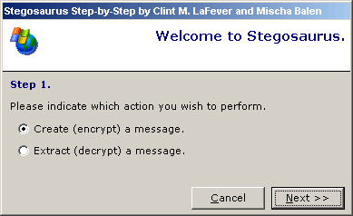



## Stegosaurus 3 \- Amazing new GUI

### Description

Steganography (hiding text in an image) example, with a fantastic new Step by Step GUI by Clint M. LaFever.
 
### More Info
 

             |
---                |---
**Submitted On**   |2002-08-23 19:04:20
**By**             |[boltfishy](https://github.com/Planet-Source-Code/PSCIndex/blob/master/ByAuthor/boltfishy.md)
**Level**          |Advanced
**User Rating**    |4.2 (25 globes from 6 users)
**Compatibility**  |VB 5\.0, VB 6\.0
**Category**       |[Encryption](https://github.com/Planet-Source-Code/PSCIndex/blob/master/ByCategory/encryption__1-48.md)
**World**          |[Visual Basic](https://github.com/Planet-Source-Code/PSCIndex/blob/master/ByWorld/visual-basic.md)
**Archive File**   |[Stegosauru1217198232002\.zip](https://github.com/Planet-Source-Code/boltfishy-stegosaurus-3-amazing-new-gui__1-38224/archive/master.zip)

